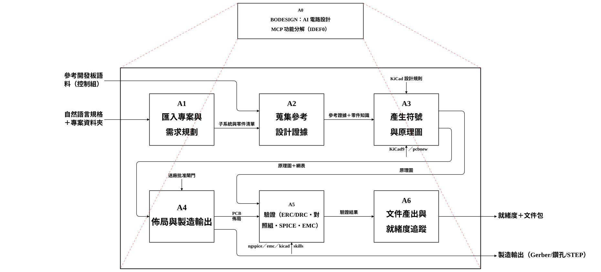
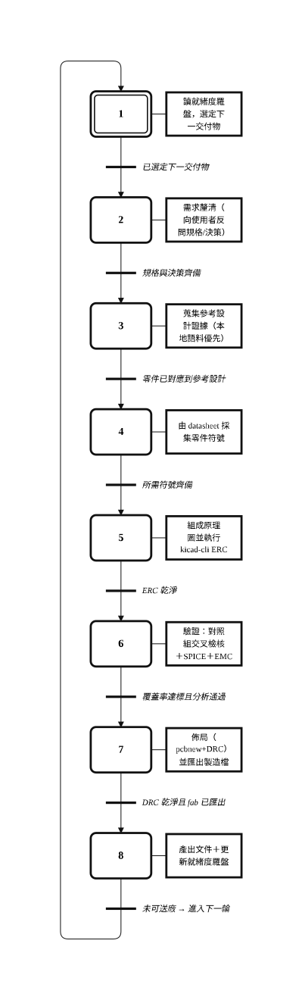

# bodesign

_語言：**繁體中文** · [English](./README.en.md)_

**bodesign** 是一個 AI 電路設計（PCB）副駕，以**獨立的 MCP server** 形式交付。
它由對談與原始輸入檔驅動，走完整個 KiCad 設計生命週期——原理圖 → 佈局 → 製造——
產出可送廠的文件包，並以**展示**可靠度（對照已知良品的交叉檢核＋KiCad/SPICE/EMC）
而非「宣稱」可靠度。

它**與宿主無關、可獨立對外營運**：任何支援 MCP 的客戶端（IDE、agent，或你自己的 HTTP 呼叫端）
都能透過 Unix socket（本機）或 TCP port（對外）驅動它。**不需要任何宿主外殼或閘道。**

## 它做什麼

- **匯入**整個專案資料夾（datasheet、原理圖、BOM、Gerber），唯讀。
- **規劃**需求：把自然語言規格轉成結構化計畫（並反問釐清）。
- **生成** KiCad 符號與經 `kicad-cli` 驗證的原理圖（以參考設計為依據）。
- **佈局**（`pcbnew` 擺件＋DRC）並**匯出製造輸出**（gerber／鑽孔／pos／STEP）。
- **驗證**四層：ERC/DRC · 對照組交叉檢核 · SPICE · EMC/熱分析。
- **追蹤就緒度**，並為每個工程檔產出可讀伴隨檔（docx/pdf）與分享文件。

## 架構圖

完整規格見 [`specs/product/pcb_ai_viewer/`](specs/product/pcb_ai_viewer/README.md)。

**IDEF0 功能分解（A0）**



**GRAFCET 執行流程（生成迴圈）**



## 執行

**Docker（可攜，建議）** — 內含 KiCad 9（`kicad-cli` + `pcbnew`）＋ LibreOffice ＋整套工具鏈：

```bash
./mcpctl.sh start     # 建置映像＋啟動容器（UDS 於 ./.run/bodesign.sock + TCP :8077）
./mcpctl.sh status    # 健康檢查＋socket
./mcpctl.sh log       # 追蹤日誌
./mcpctl.sh stop
```

**主機（不用 Docker）** — 需要 PATH 上有 `kicad-cli`、`pcbnew`、`soffice`、`ngspice`：

```bash
pip install -r services/mcp/requirements.txt
python services/mcp/server.py --transport http --uds .run/bodesign.sock --port 8077
# 或 --transport stdio 供 IDE/agent 直接使用
```

## 連線（MCP）

MCP **Streamable HTTP**，由同一個行程同時提供 UDS（本機）與 TCP（對外）：

- 本機：`unix:///…/.run/bodesign.sock:/mcp/`
- 對外：`http://<host>:8077/mcp/`

註冊資訊見 [`mcp.json`](mcp.json)。開啟 `/`（或 `http://<host>:8077/`）即是即時的自我說明指南——
安裝、檔案模型、電路設計工作流，以及 `/tools`、`/tools/{name}` 的完整 tool-call schema。

## 檔案模型（docxmcp 風格）

bodesign **不內含任何工作資料**。把專案樹以 tarball 上傳 → 取得 **token**；將 token 傳給任一工具
（路徑參數會在 token 的 `doc_dir` 內解析）；以 token 下載產出檔。伺服端的工作資料會依 TTL 自動垃圾回收。
工具也接受一般的主機路徑（本機使用）。

```bash
tar -C myproject -cf - . | curl --unix-socket .run/bodesign.sock \
     -X POST -H 'Content-Type: application/x-tar' --data-binary @- http://bd/files
curl --unix-socket .run/bodesign.sock http://bd/files/{token}/blob/{rel}
```

## Skill 套件

bodesign 負責生成；分析／文件／模擬／採購／製造則編排成熟的 **EDA skill 套件**
（`kicad`、`kidoc`、`spice`、`emc`、`datasheets`、`bom`、distributors、fab）。可從執行中的服務在
`/skills/` 下載（整包＋個別 skill），安裝到你的 skill 目錄。

## 目錄結構

```text
bodesign/
├── services/mcp/                 MCP server —— 產品的唯一對外介面
│   ├── server.py                 工具分派、token 路徑解析、UDS+TCP 雙綁定、自我說明網頁
│   ├── token_store.py            docxmcp 式 token 檔案儲存 ＋ TTL/GC
│   ├── requirements.txt
│   └── assets/skills/            EDA skill 套件（13 個 tarball ＋整包 bundle ＋ MANIFEST.md）
├── packages/                     通用能力函式庫（無產品專屬碼）
│   ├── shared/                   共用契約 ＋ data_root()（程式↔工作資料隔離邊界）
│   ├── design-ir/                DesignIntent 等中介表示（IR）
│   ├── component-kb/             可重用零件知識（datasheet 萃取）
│   ├── doc-core/                 pin-table／文件產生工具
│   ├── source-core/              來源／證據契約
│   ├── reverse-core/             專案匯入、伴隨檔渲染、文件輸出、board 重建
│   ├── gerber-core/              Gerber／鑽孔解析 ＋ 預覽
│   ├── eda-bridge/               KiCad 橋接：符號／原理圖／佈局／製造／BOM／SPICE／EMC
│   ├── workflow-core/            需求規劃、證據蒐集、就緒度羅盤、對照組交叉檢核
│   ├── storage-core/             客戶自有專案登錄
│   └── kicad-plugin/             in-KiCad Action Plugin 契約（roadmap）
├── specs/                        規格／知識庫（plan-builder）
│   ├── architecture.md           跨領域架構索引
│   └── product/pcb_ai_viewer/    已上線（living）設計規格 ＋ IDEF0/GRAFCET SVG ＋ 中文 README
├── tests/                        測試（乾淨 clone 全綠；資料相依測試自動跳過）
├── Dockerfile · docker-compose.yml · mcpctl.sh   容器封裝 ＋ 操作
├── mcp.json                      MCP 註冊資訊
└── README.md · README.en.md      本文件（繁中／英）
```

> bodesign **不內含任何工作資料**；客戶專案樹只在執行期經 token 儲存進入，或由外部 `data_root()`（`BODESIGN_DATA_DIR`）讀取。

## 可靠度邊界

交叉檢核＋SPICE/EMC 是**矽前風險層**——在打樣前抓出問題。它們**不取代**實驗室／工廠的
認證 EMC／EVT／DVT；且 bodesign 在未經確定性驗證＋明確批准前，不會輸出任何送廠檔案。
